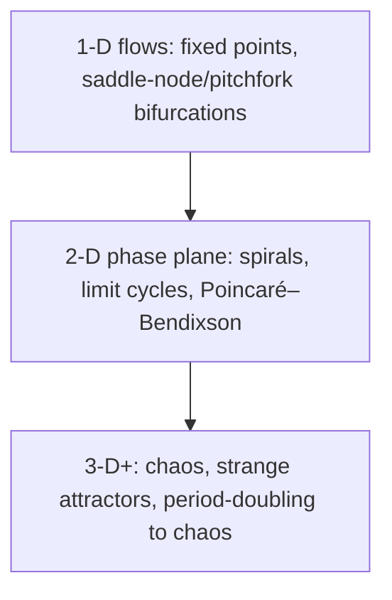

# Nonlinear Dynamics and Chaos

Steven Strogatz's *Nonlinear Dynamics and Chaos: With Applications to Physics, Biology,
Chemistry, and Engineering* is the standard undergraduate/early-graduate textbook on
nonlinear dynamics. Its distinctive method is **geometric**: rather than solving
differential equations in closed form (usually impossible for nonlinear systems), it
teaches you to reason about the *qualitative* behavior of solutions directly from the
structure of the equations — where trajectories go, what they settle onto, and how that
changes as parameters vary. It assumes only calculus and a first exposure to
[differential equations](../math/differential-equations.md).

## The progression

The book is organized by increasing dimension of the state space, because the *dimension
controls what dynamics are possible*:

- **First-order systems (1-D flows)** — fixed points, stability, and how a system can be
  understood by drawing the flow on a line. Introduces **bifurcations** (saddle-node,
  transcritical, pitchfork): qualitative changes in the number or stability of fixed
  points as a parameter crosses a threshold.
- **Two-dimensional systems (the phase plane)** — linear classification of fixed points
  (nodes, saddles, spirals, centers), **limit cycles** (isolated closed orbits, i.e.
  self-sustaining oscillations), and the Poincaré–Bendixson theorem, which guarantees that
  a bounded 2-D flow cannot be chaotic — it must approach a fixed point or a cycle.
- **Chaos (three or more dimensions)** — with the third dimension the ceiling lifts:
  **deterministic chaos** becomes possible. Strogatz develops sensitive dependence on
  initial conditions, **strange attractors** (the Lorenz system is the centerpiece), and
  the route to chaos through **period-doubling** in one-dimensional maps (the logistic
  map, Feigenbaum's universal constants), plus fractals as the geometry of these
  attractors.

## Why it anchors this field

The book is the rigorous foundation under the intuition that **simple deterministic rules
can produce unpredictable, richly structured behavior** — the mathematical core of
[chaos-and-nonlinear-dynamics.md](chaos-and-nonlinear-dynamics.md). Its central concepts
generalize across systems-thinking: **bifurcations** are the exact, mathematical form of a
tipping point in a [complex system](complex-systems.md); **limit cycles** are what a
stabilizing [feedback loop](feedback-loops.md) produces when it overshoots into
oscillation; and **attractors** formalize the stable emergent patterns a system falls
into. Strogatz's geometric, applications-first treatment is why the book bridges pure
mathematics and the study of real dynamical systems in biology, chemistry, and
engineering.

## References

- [Nonlinear Dynamics and Chaos — Steven Strogatz](https://www.stevenstrogatz.com/books/nonlinear-dynamics-and-chaos-with-applications-to-physics-biology-chemistry-and-engineering)
