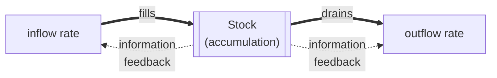

# System Dynamics

System dynamics is a modeling discipline, founded by Jay Forrester at MIT and popularized
by Donella Meadows, for understanding how systems with **feedback and delay** behave over
time. Its core insight is that the *structure* of a system — the pattern of stocks, flows,
and [feedback loops](feedback-loops.md) connecting them — determines its *behavior*, and
that this behavior is routinely **counterintuitive**. The purpose of the method is to make
the structure explicit so that intuition, which fails badly here, can be replaced by a
simulatable model.

## Stocks and flows

The building blocks are **stocks** and **flows**. A *stock* is an accumulation — the
current level of something: water in a bathtub, money in an account, CO₂ in the atmosphere,
open tickets in a backlog. A *flow* is a rate that fills or drains a stock: the faucet and
the drain, income and spending, emissions and absorption.

The crucial property is that **a stock is the integral of its flows** — it can only change
through its inflows and outflows, and it *persists*. This gives systems memory and inertia:
a stock does not respond instantly to a change in policy, because it can only be filled or
drained at the rate the flows allow. You cannot empty a full bathtub by turning off the
tap; you must wait for the drain. Formally the stock $S$ obeys
$\dfrac{dS}{dt} = \text{inflow} - \text{outflow}$ — system dynamics is applied
[differential equations](../math/differential-equations.md), integrated numerically over
time.

## Causal-loop diagrams

Before simulating, modelers sketch a **causal-loop diagram**: variables joined by arrows
labeled with the *polarity* of influence — `+` if a change moves the target the same way,
`−` if the opposite. Closed loops are then classified:

- **Reinforcing (R) loops** — an even number of negative links; they amplify change
  (compound interest, viral growth, arms races). These are positive feedback.
- **Balancing (B) loops** — an odd number of negative links; they seek a goal and resist
  change (a thermostat, market supply-and-demand). These are negative feedback.

Every dynamic behavior — exponential growth, goal-seeking, oscillation, overshoot-and-
collapse — is produced by some combination of reinforcing and balancing loops, often with
delays.

## Delays, and why intuition fails

**Delays** are the reason system dynamics is hard and the reason unaided intuition
misleads. When there is a lag between an action and its visible effect — between hiring and
productivity, between emissions and warming, between a code change and the incident it
causes — a balancing loop *overshoots*, because the operator keeps pushing while the effect
is still in the pipeline, then over-corrects the other way. The result is **oscillation**
around the goal instead of smooth settling. People systematically underweight delays and
accumulation (the "bathtub" experiments show even experts get stock-flow reasoning wrong),
which is why systems "fight back" against well-meaning interventions and produce **policy
resistance**.

## Leverage points

Meadows catalogued **leverage points** — places to intervene in a system, ranked by
effect. The counterintuitive lesson: the interventions people reach for (tweaking
parameters, adjusting numbers) are the *weakest*, while the most powerful are the ones
people rarely touch — changing the *rules*, the *information flows*, the *goals* of the
system, and ultimately the *paradigm* that the whole structure rests on. High-leverage
change alters structure, not just settings.

## Why it matters

System dynamics is the practical toolkit of [systems thinking](thinking-in-systems.md): it
turns vague talk of "feedback" into models that can be run and tested. Its lessons are
directly operational for anyone reasoning about organizations, incidents, and delivery —
the delay-driven oscillation it describes is exactly what makes staffing, inventory, and
capacity planning so error-prone, and why the [ROI and business cases](../ai-business/index.md)
around AI adoption are so easy to get wrong when benefits and costs land on different
delays. For AI-assisted engineering specifically, a coding loop with a slow verification
signal is a balancing loop with a long delay — prone to overshoot and thrash unless the
feedback delay is engineered down. The discipline's standing advice — respect delays,
prefer high-leverage structural change, expect policy resistance — applies as much to
harness design as to national policy.

## References

- [Thinking in Systems — Donella Meadows](thinking-in-systems.md) — the accessible primer
- [Complexity: A Guided Tour — Melanie Mitchell](mitchell-complexity.md)
- [Cybernetics — Norbert Wiener](cybernetics-wiener.md) — the feedback foundations
