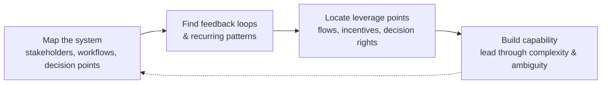

# What Is Systems Thinking in Business?

MIT Sloan Executive Education's take on systems thinking applied to **organizations and
leadership**. The through-line: businesses rarely fail from one bad decision — they fail
from the way strategies, processes, incentives, and behaviors **interact over time**,
often invisibly. Systems thinking is the discipline of stepping back to see those forces.

This is the management-facing cousin of [Goodman's practitioner primer](systems-thinking-what-why-when-where-and-how.md)
and [Crawley's entities-and-relationships framing](mit-what-is-system-thinking.md); it
leans on Meadows-style [system dynamics](system-dynamics.md) throughout.

## What it means in business

An organization is not a stack of independent units — it's an **interconnected network**.
Activity in one area (operations, tech, marketing, supply chain) influences outcomes
elsewhere in ways that aren't immediate or obvious. So instead of reacting to visible
issues, you look for the underlying conditions and recurring patterns that generate them:
**processes, incentives, resource flows, shared assumptions.**

**Benefit:** recurring pains — bottlenecks, delayed initiatives, misaligned priorities —
are usually **coordination problems, not isolated breakdowns**. Seeing across workflows
surfaces the deeper driver, aligns cross-functional priorities, and shifts the org from
*repeatedly fixing symptoms* toward *improving the conditions* that shape performance
(more durable, adaptable operating).

## Core principles

- **Interconnectedness** — the org functions as an integrated system; decisions ripple
  across functions, so move beyond siloed decision-making.
- **[Feedback loops](feedback-loops.md)** — decisions trigger reinforcing effects
  (amplify growth/adoption) or balancing ones (stabilize). Mapping them explains why some
  initiatives accelerate and others stall despite heavy initial investment.
- **Patterns over events** — a single missed target rarely tells the story; examine trends
  over time to find systemic dynamics: capacity limits, escalating inter-function
  competition, recurring resource constraints. (The iceberg move from Goodman.)
- **[Leverage points](system-dynamics.md)** — meaningful change rarely needs large-scale
  disruption. Well-placed interventions — adjusting information flows, incentives, decision
  rights, or operating assumptions — create disproportionate ripple effects.

## How to apply it

- **Map the system** — lay out stakeholders, workflows, and decision points visually.
  Reveals dependencies and informal workarounds invisible to standard reporting, and gives
  a shared reference for how work *actually* moves.
- **Build systems-thinking capability** — leaders comfortable with complexity and
  ambiguity; new analytical methods (MIT's system dynamics being the core one).

## Where businesses use it

- **Supply chain resilience** — procurement/production/forecasting/logistics as a tightly
  linked network; one inventory or supplier choice shifts cost, reliability, and
  responsiveness system-wide. (See [resilience](resilience-and-robustness.md).)
- **Innovation & product development** — coordinates customer insight, engineering,
  operational readiness, and commercialization so they evolve together, cutting friction
  between idea and execution at scale.

Related: [business](../business/index.md) · [process & teams](../process-and-teams/index.md).

## References
- [What Is Systems Thinking in Business?](https://executive.mit.edu/blog/what-is-systems-thinking-in-business.html)
