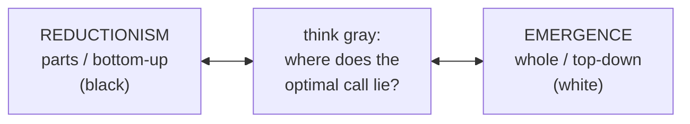

# Systems Thinking: A Balance Between Reductionism and Emergence

Jonathan Maloney (Intelligent Speculation) frames systems thinking as a **critical-thinking
mental model** for making better decisions. Its defining move: refusing to pick between
reductionism and emergence, and instead **synthesizing** the two.

## The core idea: a spectrum

- **Reductionism** — explain a complex phenomenon by breaking it down to simpler, more
  fundamental parts.
- **[Emergence](emergence.md)** — explain the same phenomenon in the context of the *whole*.

Picture a spectrum with reductionism at one end and emergence at the other. Each has
strengths and blind spots; the best description embraces the **synthesis** — thinking
about the whole system *and* how the parts fit, so you catch nuanced interactions that
would otherwise cause unintended consequences.

Maloney ties this to his "**thinking gray**" idea: reductionism is black, emergence is
white, and the systems thinker steps back and finds where in the *gray* the optimal
decision lies. More quality information about the interactions → better decisions.

## Feedback vs. linear thinking

The everyday view is **linear cause-and-effect**: A → B → C → D. Systems thinking replaces
it with **[feedback](feedback-loops.md)** — the return and transmission of information, so
D loops back to affect C and A, etc. The world is interconnected, not a chain.

Two loop types (per Meadows/[system dynamics](system-dynamics.md)):

- **Reinforcing** — the system amplifies more of the same; one element comes to dominate.
- **Balancing** — elements offset each other over time; no runaway dominance.

*Example:* sales decline → run a promotion → orders rise → demand climbs → capacity
strains → demand falls again → promotion again… A **balancing loop**, invisible to a
linear "promotion caused sales" reading.

## The iceberg & systems mapping

Systems can be **mapped** many ways (cluster maps, connected/interconnected circles,
causal loop diagrams) — all to *visualize the interrelationships* between elements so
insights and interventions surface. Maloney uses two: the **iceberg** and **causal loop
diagrams**.

The iceberg has three levels (echoing [Goodman's primer](systems-thinking-what-why-when-where-and-how.md)
and drawing on Daniel Kim's *Introduction to Systems Thinking*):

- **Events** — day-to-day circumstances (car breaks down, lost a customer).
- **Patterns** — events collated over time reveal recurring trends (market bubbles,
  relationship phases, seasonal demand).
- **Systemic structures** — how the parts are organized; the deepest, highest-leverage
  level driving the patterns.

## Takeaway

Reductionism dominated recent science, but fields where it falls short (e.g. biology)
push this century toward complex-systems science. By thinking in interconnections,
synthesis, emergence, feedback, causality, and systems mapping — rather than linear
chains — you extract deeper insight, make better decisions, and get better outcomes.

Related: [complex systems](complex-systems.md) · [emergence](emergence.md) ·
[feedback loops](feedback-loops.md). The reductionism/emergence tension is also a
[philosophy of science](../philosophy/index.md) question.

## References
- [Systems Thinking: A Balance Between Reductionism and Emergence](https://www.intelligentspeculation.com/blog/systems-thinking)
