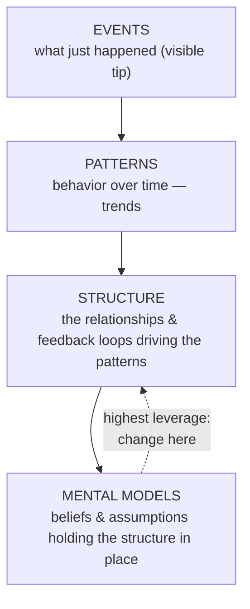

# Systems Thinking: What, Why, When, Where, and How?

Michael Goodman's practitioner's primer (from *The Systems Thinker*) on **putting
systems thinking to use** — not the theory of feedback and stocks (see
[System Dynamics](system-dynamics.md) and [Thinking in Systems](thinking-in-systems.md)
for that), but how to actually start applying it to real business problems, alone or in
an organization.

## What it involves

Systems thinking is **more than a toolkit** (causal loop diagrams, management flight
simulators). It's an underlying philosophy — a sensitivity to the *circular* nature of
the world, an awareness that **structure creates the conditions we face**, and a
recognition that our actions have consequences we're oblivious to.

It works as a **diagnostic tool**: like medicine, effective treatment follows thorough
diagnosis. It's a disciplined way to examine a problem *fully and accurately before
acting* — to ask better questions before jumping to conclusions.

The core move: descend from **events → patterns of behavior → underlying structure**.
By changing structures that don't serve us (including our own [mental
models](self-reference-and-strange-loops.md) and perceptions), we widen the choices
available and reach durable solutions to chronic problems.

The perspective demands **five C's**: curiosity, clarity, compassion, choice, and
courage — the willingness to see a situation more fully, to accept we're interrelated,
and to back interventions that may not be obvious or popular.

## Why use it

- **Expands the range of choices** — reframes a problem in new ways, broadening thinking.
- **No perfect solutions** — every choice ripples into other parts of the system.
  Anticipating each trade-off lets you minimize or even exploit it. This is *informed*
  choice.
- **Tells compelling stories** — drawing a [causal loop diagram](system-dynamics.md)
  forces a team to build a *shared picture* of a situation. The tools are vehicles for
  identifying, describing, and communicating understanding — especially in groups.

## Where to start

- **Don't assign blame** — the common (and wrong) place teams begin. Instead, focus on
  what people gloss over and arouse curiosity: ask *"What is it about this problem that
  we don't understand?"*
- **Use the iceberg** — describe the problem from all three levels (events, patterns,
  structure), not just the visible tip.
- **Get multiple perspectives** — don't assume everyone shares the same picture. Pull in
  people from different departments; their [mental models](self-reference-and-strange-loops.md)
  will surprise you, and solutions must be accepted by those who implement them.

### The iceberg framework

React to events and you firefight forever; change the structure (and the mental models
beneath it) and the patterns change with it. Deeper = more leverage.

## Tips for beginners

- Study the [archetypes](system-dynamics.md) (recurring balancing/reinforcing patterns).
- Practice frequently — newspaper headlines are free material.
- Use it both at work and at home.
- Use it to see how *others* view a system differently.
- Accept inexperience — skill comes with practice; it's a **lifelong** practice.

## How you know you've "got it"

- You're asking **different kinds of questions** than before.
- **Catchphrases raise flags** — you refocus when someone says "the problem is we need
  more [sales staff / revenue]."
- You **detect the archetypes** and balancing/reinforcing processes in stories you hear.
- You're **surfacing mental models** — your own and others'.
- You're **spotting leverage points** in the classic systems stories.

Once systems thinking anchors your inquiry and diagnosis, you can move on to richer
modeling — [stock-and-flow diagrams](system-dynamics.md), flight simulators, simulation
software — or find that causal loop diagrams alone give enough insight. Either way, it
permanently changes how you see the world.

## References
- [Systems Thinking: What, Why, When, Where, and How?](https://thesystemsthinker.com/systems-thinking-what-why-when-where-and-how/)
