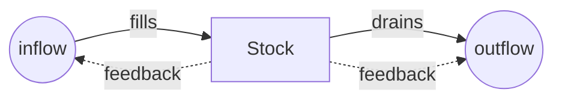
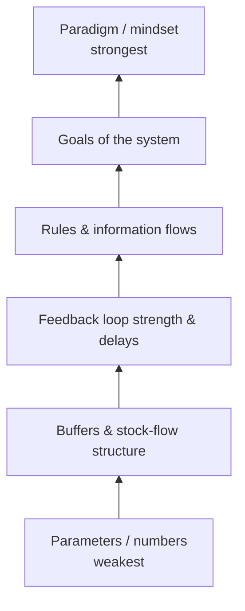

# Thinking in Systems

Donella Meadows' *Thinking in Systems: A Primer* (Chelsea Green, 2008, edited from
her manuscript by Diana Wright) is the accessible introduction to systems
thinking. Its thesis: a system's behavior comes from its **internal structure** —
its stocks, flows, and feedback loops — not from the external events that seem to
trigger it. To change persistent behavior, change the structure, not the events.

## The building blocks

- **Stock** — an accumulation you can measure at a point in time: water in a tub,
  money in an account, unresolved bugs in a backlog, trust on a team.
- **Flow** — the rates that fill or drain a stock (inflows and outflows): water
  from the tap and out the drain, bugs opened and bugs closed.
- **Feedback loop** — a chain where a stock's level influences its own flows.
  - **Balancing (negative) loops** seek a goal and create stability — a
    thermostat, or a team that slows feature work as the bug backlog grows.
  - **Reinforcing (positive) loops** amplify change and drive growth or collapse —
    compounding interest, or tech debt that makes every change slower, producing
    more debt.

Delays between a change and its effect are a recurring source of trouble: they
cause oscillation and overshoot, because actors keep pushing before the earlier
push has taken effect.

## Why systems surprise us

Meadows explains common systems traps — *policy resistance* (everyone pulling a
stock toward different goals), *tragedy of the commons*, *drift to low
performance* (eroding goals), *escalation*, and *addiction* (fixes that undermine
the system's own capacity). These arise not from bad actors but from structure, so
blaming individuals rarely helps — a theme shared with
[Ironies of Automation](ironies-of-automation.md) and
[How Complex Systems Fail](how-complex-systems-fail.md).

## Leverage points

The book's most-cited contribution is the ranked list of **leverage points** —
places to intervene in a system, from least to most powerful. Roughly: tweaking
parameters and numbers is the weakest lever; adjusting buffers and stock/flow
structures is stronger; changing the strength or direction of feedback loops is
stronger still; and the strongest levers are the system's **information flows,
rules, goals, and the paradigm** out of which the system arises. The
counterintuitive takeaway: the levers people reach for first (the numbers) move
the least, while the levers that move the most (goals, mindset) are the ones
people rarely touch.

## Why it matters

Systems thinking is a general-purpose lens for anything with delayed, looping
behavior — organizations, adoption efforts, the SDLC, an agent's feedback loop.
It reframes "why does this keep happening?" as a structural question. It connects
to the cybernetics roots in
[An Introduction to Cybernetics](introduction-to-cybernetics.md), and its
leverage-point framing is a useful discipline when reasoning about where to
intervene in an organization's AI adoption or a codebase's health rather than
treating symptoms.

## References

- [Thinking in Systems — Chelsea Green](https://www.chelseagreen.com/product/thinking-in-systems/)
