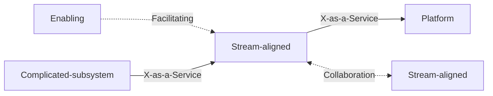

# Team Topologies

Matthew Skelton and Manuel Pais argue that the **team**, not the individual, is the
fundamental unit of software delivery, and that organizations should deliberately
design their team structures and communication paths for **fast flow of value**. The
book gives a small, opinionated vocabulary for org design so teams stop reorganizing by
gut feel and start treating structure as something evolvable and intentional.

## Four fundamental team types

Every team should be one of these — collapse the sprawl of ad hoc teams into just four:

- **Stream-aligned** — aligned to a single valuable flow of work (a product, service,
  or user journey). This is the primary team type; every other type exists to make
  stream-aligned teams more effective. It owns its slice end to end.
- **Platform** — provides internal services that reduce the cognitive load of
  stream-aligned teams (CI/CD, infrastructure, observability, deployment). Consumed
  self-service.
- **Enabling** — a coaching/specialist team that helps stream-aligned teams acquire
  missing capabilities (test automation, security, a new tech), then steps away. It is
  explicitly temporary in any given engagement.
- **Complicated-subsystem** — owns a part that needs deep specialist knowledge
  (a video codec, a pricing engine, an ML model), so that stream-aligned teams don't
  have to carry that expertise.

## Three interaction modes

Teams should also be explicit about *how* they interact, and only in one of three ways:

- **Collaboration** — two teams work closely together for a bounded time to discover
  new patterns. High bandwidth, high cost; use it to explore, not as a steady state.
- **X-as-a-Service** — one team consumes something another provides with minimal
  friction (the platform model). Low bandwidth, predictable; the goal state for most
  platform relationships.
- **Facilitating** — one team (usually enabling) helps another remove impediments or
  learn. Temporary, coaching-shaped.

## Conway's Law and the reverse maneuver

Conway's Law says a system's architecture mirrors the communication structure of the
org that built it. Team Topologies takes this as a design lever: the **Inverse Conway
Maneuver** is deliberately shaping teams to match the architecture you *want*, so the
software you produce inherits the desired boundaries rather than the accidental ones.
This is the organizational counterpart to a clean
[microservice architecture](microservice-architecture.md).

## Cognitive load

A team has finite cognitive load. Loading a team with too many disparate domains,
tools, and services degrades flow and quality. The book uses cognitive load as a
first-class sizing constraint: give a team a domain it can actually hold in its head,
and offload the rest to platform and complicated-subsystem teams.

## Platform as a product

A platform is only worth building if teams *want* to use it. Skelton and Pais treat the
internal platform as a **product** with real users (the stream-aligned teams), a UX,
adoption metrics, and a mandate to reduce friction rather than impose control. This idea
underpins modern platform engineering and connects to the flow arguments in
[Accelerate](accelerate.md) and [Effective DevOps](effective-devops.md), and to the
reliability practices in [Site Reliability Engineering](site-reliability-engineering.md).

## References

- [Team Topologies — IT Revolution](https://itrevolution.com/product/team-topologies/)
