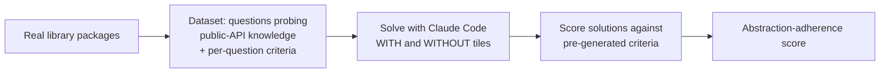

# A Proposed Evaluation Framework for Coding Agents (Tessl Tiles)

Tessl's research (Shaposhnikov, Gorinova, Willoughby, Knox, Nov 2025) on a
recurring coding-agent failure: **misusing public APIs**. Proposes a benchmark
for "abstraction adherence" and shows that feeding agents versioned library docs
("tiles") lifts correct API use ~35%. A concrete data point for
[public benchmarks](public-benchmarks.md) and a specific case of
[context engineering](context-engineering.md).

## Why agents misuse public APIs

Software runs on reuse, but interfaces demand precise invocation and evolve
across versions. LLMs are pre-trained on **static, inconsistent, unevenly
distributed** data, so they introduce incompatible dependencies, **invent APIs**,
use them non-idiomatically, and reimplement abstractions that already exist. The
thought experiment: a model pre-trained on PyTorch *before* 2.x never saw the new
API and has no way to use it correctly. The result is low-quality, broken,
hard-to-reuse code.

## The benchmark: abstraction adherence

Built on a Terminal Bench environment with Claude Code. Measures both
**correctness** and **idiomatic adherence** to the library's intended usage.
Validated by ranking Anthropic models of known strength (Haiku 3.5 → Sonnet 4.5)
— the benchmark correctly sorts them, so higher scores really do mean better
API use.

## The finding

- Standalone agents (Claude Code, Cursor) hit only **~60% accuracy** on these
  tasks.
- Pairing the agent with **tiles** — versioned documentation for a library,
  embedded into the agent's environment and kept in sync with the user's exact
  stack — gives a **~35% relative improvement** overall in abstraction adherence.
- For **recently released** libraries the gain averages **~50%**; a LangGraph
  case study on brand-new features reaches **~90%**.
- Tiles also cut runtime and token use. Tessl's Tile Registry covers 10,000+
  open-source libraries.

The lesson generalizes: the fix for stale pre-training knowledge is not a bigger
model but **giving the agent the right, current context** — the
[context engineering](context-engineering.md) thesis, measured.

## References
- [A Proposed Evaluation Framework for Coding Agents: Tiles Enhance Proper Use of Public APIs by ~35% — Tessl](https://tessl.io/blog/proposed-evaluation-framework-for-coding-agents)
