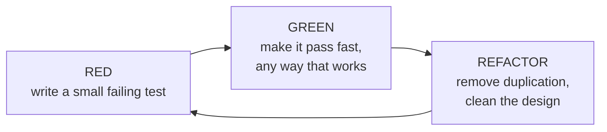

# Test-Driven Development: By Example

Kent Beck's foundational book (Addison-Wesley, 2002) on **test-driven development** —
writing the test *before* the code, and letting that constraint shape the design. It is
the primary source behind HAL's general TDD notes:
[TDD: Unit Tests and Hexagonal Boundaries](tdd-unit-tests.md) and
[TDD and Its Five Supporting Practices](tdd-five-practices.md), and it informs how the
craft is [learned in the AI era](learning-the-craft.md).

The book is deliberately practical: rather than argue for TDD in the abstract, Beck works
two examples in full and only then distills the patterns. It reads as a demonstration, not
a lecture — you watch the rhythm before you name it.

## The core rhythm: red / green / refactor

TDD is a short, repeating loop. Each pass is small enough that you are never more than one
step from a working system.

- **Red** — write a test for a behavior that doesn't exist yet, and watch it fail. A
  failing test proves the test can fail (so a later pass means something) and states the
  next increment of intent.
- **Green** — do the *fastest* thing that turns the bar green, even if it's ugly. Speed
  to green matters more than elegance here; cleanliness comes next.
- **Refactor** — with a passing test as a safety net, improve the structure. This is where
  the design actually emerges.

## The two rules

Beck reduces the whole discipline to two rules that generate everything else:

1. **Write new code only when an automated test is failing.** No test, no production code.
2. **Eliminate duplication.** Remove it wherever it appears — including duplication
   between the test's data and the code's logic.

Beck's claim is that these two rules, followed strictly, *imply* an order of development
and a set of design decisions. Removing duplication in particular is what drives the
design forward: the move from a hardcoded value to a real computation is usually the act
of deleting duplication between test and code.

## Three strategies to get to green

Once a test is red, there are three ways to make it pass — chosen by how confident you are:

- **Fake it (till you make it)** — return a literal constant that satisfies the test, then
  gradually replace the constant with real logic by driving out the duplication between the
  fake value and the test's expected value. The smallest possible step.
- **Obvious implementation** — when the real code is trivial and you're sure of it, just
  type it in. Don't fake something you already know how to write.
- **Triangulation** — when you're unsure how to generalize, add a *second* test with
  different data. Two concrete examples force the general implementation into existence,
  because a single constant can no longer satisfy both. Use it as a fallback when the
  generalization isn't obvious.

The art is knowing which gear to be in: obvious implementation when confident, fake-it or
triangulation when the ground is uncertain. Beck advocates taking small steps when unsure
and larger ones when sure — the step size is a dial, not a fixed rule.

## Part I — the Money example (multi-currency)

The first worked example builds a small multi-currency money system. It starts from a test
that multiplies a `Dollar` by a number, and grows — through faking, then triangulation —
into a design with a general `Money` type, currency, and an `Expression`/`Bank` model that
can *add amounts in different currencies* and reduce them to a target currency. The point
is to watch design decisions (value objects, equality, avoiding side effects, generalizing
`Dollar` and `Franc` into `Money`) fall out of the tests one at a time, with duplication
removal as the engine each step. Nothing is designed up front; the structure is discovered.

## Part II — the xUnit example (a testing framework, test-first)

The second example is self-referential and instructive: Beck builds a small **testing
framework** (an xUnit) using test-first development — bootstrapping the tool with the very
method it embodies. It works out how a framework runs a test method, invokes `setUp` and
`tearDown`, reports results, and aggregates tests into a suite. Building the tool with its
own discipline demonstrates that TDD scales to genuinely tricky, foundational code.

## Part III — TDD patterns

The final part names the practices the examples demonstrated, as a reference catalog. Among
them:

- **Red-bar patterns** — how to choose and write the next test: *one step test* (pick a
  test that teaches you something and that you're confident you can make pass), *starter
  test*, *explanation test*, *test data*, and knowing when to stop.
- **Green-bar patterns** — how to pass a test: *fake it*, *triangulate*, *obvious
  implementation*.
- **xUnit patterns** — assertions, fixtures, `setUp`/`tearDown`, exception testing.
- **Design patterns via TDD** — how familiar patterns (Value Object, Null Object,
  Template Method, Pluggable Object, Collecting Parameter) arise naturally as answers to
  design pressure surfaced by tests.
- **Refactoring** — small, behavior-preserving moves (isolate change, migrate data,
  extract method, reconcile differences) done under a green bar.
- **Mastering TDD** — meta-guidance: how big a step to take, how much to test, when TDD
  fits and when it doesn't, and the psychological effect of always-green code.

## How TDD drives design

The through-line of the book: **tests are a design tool, not just a verification tool.**

- Writing the test first forces you to use the code before it exists, so you design the
  *interface* from the caller's point of view — which tends to produce cleaner, more usable
  APIs. This is the same insight behind the test boundary sitting at the
  [ports, not inside the domain](tdd-unit-tests.md).
- Relentless duplication removal in the refactor step is what pushes toward good structure;
  the design *emerges* from the loop rather than being specified up front.
- A comprehensive test suite makes refactoring safe, so you can keep the design clean
  continuously instead of accumulating debt. That safety net is the foundation the wider
  [supporting practices](tdd-five-practices.md) — refactoring, modular architecture,
  continuous delivery, specification by example — build on.
- The tight loop manages fear and cognitive load: you're never far from a known-good state,
  which is what makes it sustainable day to day.

## References
- [Test-Driven Development: By Example — Kent Beck (O'Reilly / Addison-Wesley)](https://www.oreilly.com/library/view/test-driven-development/0321146530/)
