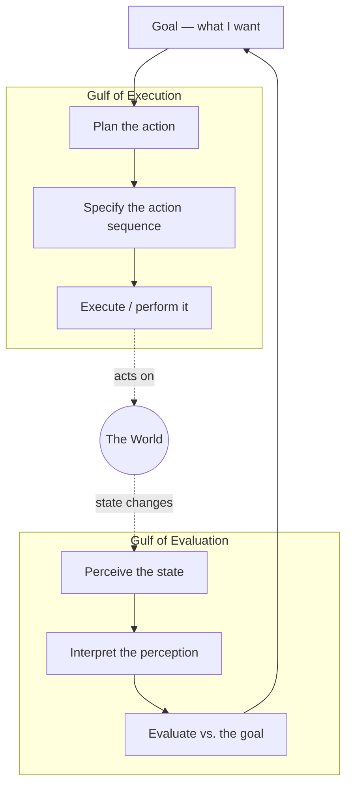

# The Design of Everyday Things

Don Norman's foundational text on **human-centered design**: the argument that when a
person struggles with an object — a door, a stove, a light switch — the fault lies with
the design, not the person. Good design makes the right action obvious and the wrong
action hard; bad design blames its victims. The book turned "usability" from a
nice-to-have into a discipline.

> **Edition note.** The copy ingested here is the **2002 Basic Books paperback**, which
> reprints the original 1988 text (first published as *The Psychology of Everyday Things*)
> with a new 2002 preface. The 1988/2002 text uses the single term **affordances**; the
> **signifiers** vocabulary below was introduced later in the **2013 Revised & Expanded
> Edition** (the edition the `source` link points to). Both are captured here so the note
> reflects Norman's mature framework.

## Human-centered design

Design should start from the needs, capabilities, and behavior of people, then fit the
technology to them — not the other way around. The measure of a design is not how it
looks or how clever it is, but whether a first-time user can figure out what to do without
a manual. Complements Krug's usability-through-self-evidence argument in
[Don't Make Me Think](dont-make-me-think.md).

## The fundamental principles

- **Affordances** — the relationship between an object and a user: what actions the object
  *makes possible*. A handle affords pulling; a flat plate affords pushing. Affordances are
  about capability, not appearance.
- **Signifiers** — the perceivable *signal* that tells you an affordance exists and how to
  use it. An affordance can exist but be invisible; the signifier is what communicates it
  (a label, a shape, an arrow, a glow). Affordances make actions *possible*; signifiers
  make them *discoverable*. (2013-edition refinement of the original "perceived
  affordance.")
- **Mapping** — the correspondence between controls and their effects. A **natural mapping**
  exploits spatial or physical analogy so the layout of controls mirrors the layout of what
  they control (stove burners arranged like the knobs, a seat-adjustment control shaped like
  the seat).
- **Feedback** — immediate, informative confirmation that an action registered and what its
  result was. Absent or delayed feedback leaves users unsure, repeating actions, or giving up.
- **Constraints** — physical, logical, semantic, and cultural limits that reduce the space
  of possible actions and prevent errors (a plug that only fits one way; a step that must
  precede another).
- **Conceptual models** — the user's mental model of how the thing works. Good design is an
  act of *communication*: the device must convey a usable model of itself through its own
  appearance and behavior. When designers supply no model, users invent one — often wrong.

## The Gulfs of Execution and Evaluation

Two gaps stand between intention and understanding:

- **Gulf of execution** — the gap between what the user *wants to do* and what the system
  *lets them do*. Bridged by discoverable affordances, signifiers, constraints, and good
  mappings.
- **Gulf of evaluation** — the gap between the system's *actual state* and the user's ability
  to *perceive and interpret* it. Bridged by feedback and a visible conceptual model.

Design succeeds when both gulfs are narrow: the user always knows what they can do and what
just happened.

## The Seven Stages of Action

Norman's model of how people act, spanning both gulfs. Execution runs top-down; evaluation
runs bottom-up.

Each stage is a place a design can help or fail: an unclear signifier breaks *specify*;
missing feedback breaks *perceive*; a bad conceptual model breaks *interpret*.

## Discoverability and understanding

Two questions a person silently asks of any object:

- **Discoverability** — *Can I figure out what actions are possible and how to do them?*
  (affordances + signifiers + constraints + mappings)
- **Understanding** — *What does it all mean? What state is it in? What just happened?*
  (conceptual model + feedback)

A well-designed thing answers both by itself, with no instructions.

## Human error as a design failure

Norman reframes "human error" as almost always a **design error**. If a system routinely
provokes mistakes, the design invited them. He splits errors into two kinds:

- **Slips** — the *right intention*, wrong execution. You knew what to do but did it wrong
  (hit the adjacent switch, poured coffee into the sugar). Skill-based, automatic behavior
  gone astray.
- **Mistakes** — the *wrong intention*. The plan itself was flawed, usually from a wrong
  conceptual model or a misreading of the situation.

**Design for error**: assume people will err, and build systems that tolerate it —
constraints that block impossible actions, confirmations for destructive ones, sensible
defaults, undo, and states that make errors easy to detect and reverse.

## "Norman doors"

The book's most famous artifact: a door you can't tell how to operate — push or pull, left
or right — because its hardware sends the wrong signal (a pull handle on a door that pushes).
The mismatch between signifier and required action is so emblematic that these are now called
**"Norman doors."** A door should need no sign; a sign on a door is a small monument to a
design failure.

## Related notes

- [Don't Make Me Think](dont-make-me-think.md) — the same self-evidence principle applied to
  web usability.
- [Color Psychology: What Colors Communicate](color-psychology.md) — color as a signifier and
  communication channel in design.

## References

- [The Design of Everyday Things — Revised & Expanded Edition (jnd.org)](https://jnd.org/the-design-of-everyday-things-revised-and-expanded-edition/)
