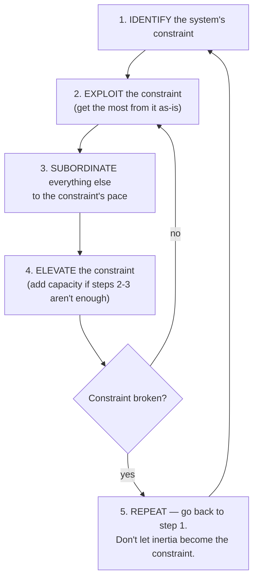

# The Goal: A Process of Ongoing Improvement

Eliyahu Goldratt (with Jeff Cox) published *The Goal* in 1984. It is the founding text
of the **Theory of Constraints (TOC)** and one of the most influential management books
ever written — and it is written as a **business novel**, not a treatise.

## The business-novel framing

The story follows Alex Rogo, a plant manager given three months to turn around a failing
factory or see it closed. Through Socratic conversations with a physicist mentor,
Jonah, Alex rediscovers what his plant is actually *for*. Goldratt uses the narrative
deliberately: the reader learns the reasoning by watching Alex reason, so the method —
not just the conclusions — is what sticks. The dramatized shop floor makes an abstract
systems argument concrete and memorable.

## The goal is throughput, measured in money

The book's opening move is to force a single answer to "what is the goal of the
business?" The answer: **to make money**. Everything else — efficiency, full utilization,
technology, headcount — is only good insofar as it serves that goal. Goldratt reframes
operations around three measures that connect the shop floor to the bottom line:

- **Throughput** — the rate at which the system generates money through *sales* (not
  production). Making product that doesn't sell is not throughput.
- **Inventory** — all the money tied up in things the system intends to sell.
- **Operating expense** — the money spent turning inventory into throughput.

The goal is to **increase throughput while simultaneously reducing inventory and
operating expense.** The counterintuitive punchline is that keeping every worker and
machine busy ("local efficiency") usually *hurts* the goal — it inflates inventory and
operating expense without moving throughput. A system's output is governed by its
bottlenecks, not by the busyness of its non-bottlenecks.

## The Theory of Constraints and the five focusing steps

Every system has at least one **constraint** — the single resource or policy that limits
total throughput, exactly as the weakest link limits a chain. Improving anything *other*
than the constraint is a mirage: it produces local motion, not system gain. TOC is a
process of **ongoing** improvement built on five focusing steps applied in a loop:

Step five carries the crucial warning: once a constraint is broken the constraint moves
somewhere else, and you must go back to the start — never let **inertia** (yesterday's
rules and habits) become the new constraint.

## Lineage into Lean and DevOps

*The Goal* sits in the same intellectual river as Lean and the Toyota Production System:
both attack the illusion that maximizing local utilization maximizes output, and both
manage flow against a limiting pace. See [Lean Thinking](lean-thinking.md) for the
value-stream framing and [Toyota Kata](toyota-kata.md) for the improvement-routine
discipline. Its most direct modern descendant in software is DevOps: Gene Kim's *The
Phoenix Project* is an explicit homage that reworks *The Goal*'s plant into an IT
organization, and the flow/throughput lens Goldratt introduced underpins the delivery
metrics validated empirically in [Accelerate](accelerate.md) — where the constraint to
identify and elevate is whatever most slows the path from idea to running software.

## References

- [The Goal (30th Anniversary edition) — The North River Press](https://northriverpress.com/the-goal-30th-anniversary-edition/)
