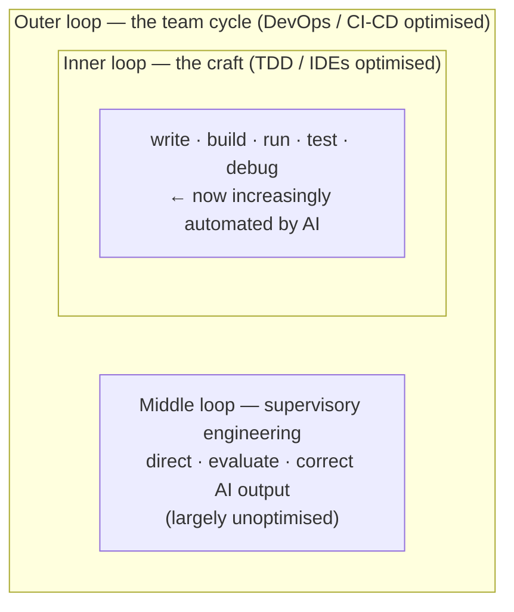

# The Middle Loop

**Annie Vella** names the layer of work that AI-assisted engineering has quietly created:
the space between the agent's fast inner cycle and the team's slow outer cycle, where a
human directs, evaluates, and corrects what the AI produced. She calls it the
**middle loop**, and her point is that it is real, it is where engineers now spend their
time, and it is almost entirely unoptimised.

## The three-loop model

Software already talks about two loops. Vella slots a third between them.

- **Inner loop** — where the craft lives: write code, build, run, test, debug. Tight,
  fast, local. This is what TDD and better IDEs optimised. AI is now automating it.
- **Outer loop** — the broader cycle: commit, code review, CI, deploy, monitor, feedback.
  This is what DevOps and CI/CD optimised.
- **Middle loop** — the new layer. Someone still has to *direct* the AI's work,
  *evaluate* its output, and *correct* what is wrong. That supervisory work is a loop of
  its own, sitting between the automated inner loop and the human outer goals.

## Why it deserves a name

As AI absorbs the inner loop, the engineer's centre of gravity shifts up into supervision.
But the middle loop has no mature tooling: engineers assemble it by hand out of chat
windows, terminal agents, and IDEs, stitching together direction and review with nothing
purpose-built. Naming the loop is the first step to optimising it — the same move that
made the inner loop (TDD, hot reload) and outer loop (CI/CD) tractable once they were
named.

This reframes the "orchestrator" shift in [From Coder to Orchestrator](from-coder-to-orchestrator.md)
and [Five Engineering Archetypes (Boris Cherny)](five-engineering-archetypes.md) as a
concrete *loop* to be engineered, not just a role change. It complements
[Loop Engineering](loop-engineering.md) (which optimises the *agent's* outer loop) by
insisting there is still a distinctly **human** loop that automation does not remove — it
relocates. It also sets up the junior-developer concern in
[AI Won't Kill Junior Devs](ai-wont-kill-junior-devs.md) and
[Revenge of the Junior Developer](revenge-of-the-junior-developer.md): if the middle loop
is where the work now is, that is where skills must form.

## What comes next

Vella flags this as the first post in a series from her Master's research. The next theme
is the **productivity–experience paradox**: when measured productivity holds steady but
developer *experience* erodes — a warning that optimising the middle loop for throughput
alone can quietly degrade the people doing the work.

## References

- [The Middle Loop — Annie Vella](https://annievella.com/posts/the-middle-loop/)
