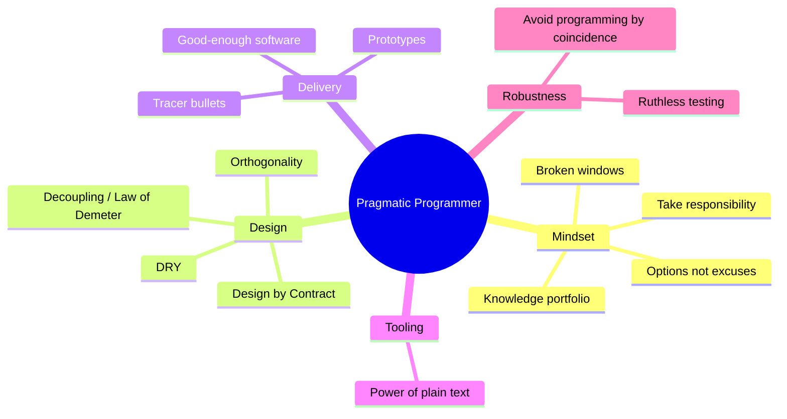

# The Pragmatic Programmer — From Journeyman to Master

Andrew Hunt and David Thomas's 1999 classic (Addison-Wesley). This note covers the
**original** "From Journeyman to Master" edition, not the later 20th-anniversary
rewrite. The book is a pattern language disguised as a list of tips: a set of
attitudes and concrete habits that add up to treating software development as a
craft you deliberately improve at. Everything below is synthesized in my own words.

## The pragmatic mindset

The core stance is **taking responsibility for your work and your career**. A
pragmatic programmer doesn't hide behind process or blame the tools; when something
goes wrong, they **provide options rather than lame excuses**. You own the outcome,
so you think about consequences, keep your skills sharp, and refuse to let quality
quietly rot around you. This is the applied-craft attitude that also runs through
[Learning the Craft](learning-the-craft.md).

### Software entropy and the broken-windows theory

Neglect accelerates decay. One unrepaired "broken window" — a bad design, a sloppy
hack, a disabled test — signals that nobody cares, and the rest of the system rots
to match. The fix is to repair damage as soon as you see it, or at least board it
up (a comment, a stub, a failing-test marker) so it doesn't spread. Quality is a
ratchet, not a phase.

### Stone soup and being a catalyst for change

When you can't get buy-in for a big change, don't ask permission for the whole
thing. Build a small, working, visibly useful piece — the "stone" — and let others
add to it once they see it going somewhere. You act as a catalyst rather than
demanding the finished vision up front.

### Good-enough software

"Good enough" is not sloppy; it's *scoped*. Involve users in the tradeoff of how
good is good enough, know when to stop polishing, and don't wreck a decent program
by over-refining it. Quality is a requirement you negotiate, not an absolute you
chase forever.

### Your knowledge portfolio

Manage what you know like a financial portfolio: **invest regularly**, **diversify**
(languages, domains, paradigms), **manage risk** (mix stable and speculative
skills), and **rebalance**. Learn a new language every year, read technical books,
stay current — a knowledge portfolio compounds the same way money does.

## Core engineering principles

### DRY — Don't Repeat Yourself

*Every piece of knowledge should have a single, unambiguous, authoritative
representation in the system.* Duplication isn't just copied code; it's knowledge
expressed twice (in code and a comment, in a schema and a validator, across two
modules). When it's duplicated, the copies drift and one gets missed on a change.
Make it easy to reuse the single source so people don't re-implement it.

### Orthogonality

Independent, decoupled components: changing one thing doesn't ripple into unrelated
ones. Orthogonal systems are easier to test, reuse, and reason about because
effects stay local. The book's helicopter analogy — every control affects every
axis at once — is the picture of a *non*-orthogonal system, where nothing can move
without disturbing everything else.

### Tracer bullets vs. prototypes

Two different tools for uncertainty:

- **Tracer bullets** — build a thin, end-to-end, *production-quality* skeleton that
  runs all the way through the real architecture. You keep it and flesh it out; it
  gives immediate feedback that the pieces connect. Fire, see where it lands,
  adjust — in the dark, under real conditions.
- **Prototypes** — throwaway code to answer a specific question (Is this UI usable?
  Is this algorithm fast enough?). Once it has answered the question, you throw it
  away. The danger is letting a prototype quietly become the product.

### Design by Contract

Specify each routine's **preconditions** (what must be true to call it),
**postconditions** (what it guarantees on return), and **invariants**. Contracts
make responsibilities explicit and let you fail fast when they're violated, rather
than propagating bad state. Related to "crash early" — a dead program does far less
damage than a crippled one limping along on corrupt data.

### Decoupling and the Law of Demeter

Write **shy** code that only talks to its immediate collaborators — don't reach
through one object to get at another's internals (`a.getB().getC().doThing()`).
Minimizing the objects a method knows about reduces coupling, so changes don't
cascade. This is orthogonality applied at the method level.

### The power of plain text

Keep knowledge in plain text, not proprietary binary formats. Plain text is
future-proof, human-readable, testable with ordinary tools, and it plays with the
whole Unix toolbox. It doesn't go obsolete when the tool that wrote it does. Pair
this with mastering your shell and one editor deeply.

### Programming by coincidence

Don't rely on code that *happens* to work without understanding *why*. Coincidental
success — depending on undocumented behavior, uninitialized values, or accidental
timing — is a landmine: it works until it doesn't, and you have no idea why it
broke. Program deliberately: know what your code does, why, and what it assumes.

### Ruthless testing

Test early, test often, test automatically. Aim to test both the code and its
boundaries, and treat a test that finds a bug as a success. "Good-enough" quality is
defended by tests you can run cheaply and constantly — code isn't done until it's
tested. This habit is the foundation the discipline in
[TDD: Five Practices](tdd-five-practices.md) builds on, and continuous refactoring
under a test safety net is exactly the workflow in
[Refactoring: Improving the Design of Existing Code](refactoring-improving-the-design-of-existing-code.md).

## Why it holds up

The advice predates modern tooling by decades yet still lands, because it's about
*attitudes and tradeoffs* rather than any specific technology: own your work, keep
knowledge singular and decoupled, get feedback early, understand what you're doing,
and never stop learning. It reads as a foundational text for anyone
[learning the craft](learning-the-craft.md).

## References

- [The Pragmatic Programmer: From Journeyman to Master (O'Reilly)](https://www.oreilly.com/library/view/the-pragmatic-programmer/020161622X/)
