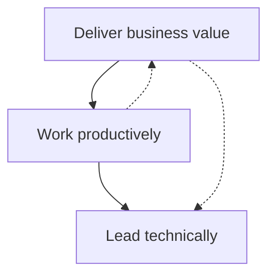

# The Senior Software Engineer

David Bryant Copeland's *The Senior Software Engineer: 11 Practices of an
Effective Technical Leader* argues that seniority is a matter of **effectiveness and
leadership, not tenure**. You don't become senior by accumulating years; you become
senior by consistently delivering business value, working productively, and lifting the
people and systems around you. The book frames the transition as a set of concrete,
learnable practices rather than an aura you grow into.

## Seniority is measured by impact, not years

The organizing idea is that a senior engineer is defined by *outcomes*. Junior work is
often measured by "did you complete the task assigned to you." Senior work is measured by
"did the business get what it actually needed" — which frequently means questioning the
task, choosing what *not* to build, and taking responsibility for results end to end.
This mirrors the leverage-first mindset in [The Effective Engineer](the-effective-engineer.md):
optimize for high-impact work, not busywork.

## The practices

The book's practices cluster into three themes.

### Deliver business value

- **Focus on delivering results.** Understand the *why* behind a feature before writing
  code. The measure of success is value shipped, not lines produced or tickets closed.
- **Add features cleanly.** New functionality should extend the system without degrading
  it — leave the codebase at least as healthy as you found it. This is the same
  boy-scout discipline emphasized in [The Pragmatic Programmer](the-pragmatic-programmer.md).
- **Fix bugs efficiently.** Reproduce first, write a failing test that captures the
  defect, then fix it so the bug stays fixed and can't silently return.

### Work productively

- **Be productive.** Master your tools, automate the repetitive, and remove friction from
  your own workflow so more of your day goes to high-value work. Fluency with the
  everyday tools is part of the craft — the ongoing skill-building described in
  [Learning the Craft](learning-the-craft.md).
- **Make decisions with data, not opinion.** When there's a technical disagreement,
  reach for evidence — benchmarks, profiling, experiments, measured tradeoffs — rather
  than arguing from authority or preference. A data-backed decision is defensible and
  teachable.

### Lead technically

- **Give and take code reviews well.** As a reviewer, be specific, kind, and focused on
  the code rather than the author; as an author, treat feedback as a gift and don't take
  it personally. Reviews are a primary channel for spreading standards and mentoring.
- **Interview and hire.** Senior engineers shape the team they'll work in. Run interviews
  that assess real ability, reduce bias, and reliably identify people who will raise the
  bar.
- **Be a technical leader and mentor.** Multiply your impact through others: teach,
  unblock, set direction, and grow the people around you. Leadership here is influence
  and stewardship, not a management title.

## Why it matters

The through-line is **taking ownership**. A senior engineer treats the health of the
codebase, the productivity of the team, and the value delivered to the business as their
responsibility — not someone else's. Each practice is a lever for turning individual
competence into team-level and organization-level impact.

## References

- [The Senior Software Engineer — David Bryant Copeland](http://www.theseniorsoftwareengineer.com)
