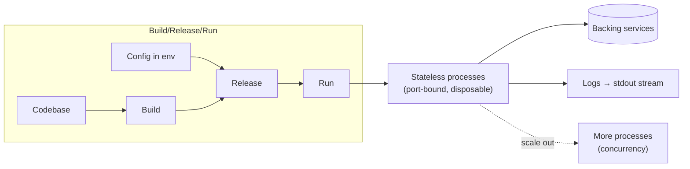

# The Twelve-Factor App

The **Twelve-Factor App** is a methodology (written by Adam Wiggins and colleagues at Heroku)
for building software-as-a-service apps that are portable, disposable, and easy to scale. It
distills patterns that hold across languages and backing services. The stated goals: use
**declarative** setup so new developers onboard fast; keep a **clean contract** with the
operating system for maximum portability; be suitable for deployment on **modern cloud
platforms**; **minimize divergence** between development and production for continuous
deployment; and **scale up** without major changes to tooling or architecture.

## The twelve factors

1. **Codebase** — one codebase tracked in version control, many deploys. One-to-one between an
   app and its repo; multiple apps sharing code means a shared library, not a shared codebase.
2. **Dependencies** — explicitly declare and isolate dependencies. Never rely on implicit
   system-wide packages; use a manifest and dependency isolation so nothing leaks in from the host.
3. **Config** — store configuration (anything that varies between deploys: credentials,
   hostnames, per-env values) in the **environment**, not in code. The litmus test: could you
   open-source the codebase right now without leaking secrets?
4. **Backing services** — treat backing services (databases, queues, SMTP, caches) as
   **attached resources** accessed via a URL/config. A local MySQL and a third-party database
   should be swappable with only a config change.
5. **Build, release, run** — strictly separate the three stages. *Build* turns code into a
   bundle; *release* combines the build with config; *run* executes it. Releases are immutable
   and identified (e.g. a timestamp or increasing number); you cannot mutate code at runtime.
6. **Processes** — execute the app as one or more **stateless, share-nothing** processes. Any
   persistent state goes to a backing service. Never rely on sticky in-memory/local-disk state
   between requests.
7. **Port binding** — export services via **port binding**. The app is self-contained (bundles
   its own web server) and binds to a port; it is not injected into a runtime webserver container.
8. **Concurrency** — scale out via the **process model**. Structure work into process *types*
   (web, worker) and scale horizontally by running more processes, delegating process management
   to the OS/platform rather than daemonizing internally.
9. **Disposability** — maximize robustness with **fast startup and graceful shutdown**.
   Processes are disposable: they can start or stop at a moment's notice, which aids elastic
   scaling, rapid deploys, and resilience.
10. **Dev/prod parity** — keep development, staging, and production **as similar as possible**.
    Minimize the time gap (deploy hours after writing), the personnel gap (authors deploy), and
    the tools gap (same backing services everywhere) so continuous deployment is safe.
11. **Logs** — treat logs as **event streams**. The app writes to `stdout`, unbuffered; it never
    concerns itself with routing or storage. The execution environment captures and routes the stream.
12. **Admin processes** — run admin/management tasks (migrations, one-off scripts, console) as
    **one-off processes** in an identical environment against the same release and config as the
    long-running processes.

## Takeaways

- The unifying idea: a **clean separation between the app and its environment**. Everything that
  varies between deploys lives in config/backing services; the app itself is one portable,
  stateless, disposable unit.
- It predates and underpins modern **cloud-native / container** practice — statelessness,
  externalized config, and log streaming are exactly what orchestrators like Kubernetes assume.
- Many later critiques note it targets stateless web services and needs extension for data-heavy
  or stateful systems, but the twelve factors remain a baseline checklist for SaaS design.

Related notes in HAL: [Microservice Architecture](microservice-architecture.md),
[Production-Ready Microservices](production-ready-microservices.md),
[Effective DevOps](effective-devops.md),
[Clean Architecture](clean-architecture.md),
[Hexagonal Architecture (Ports and Adapters)](hexagonal-architecture-ports-and-adapters.md).

## References

- [The Twelve-Factor App — Adam Wiggins](https://12factor.net)
