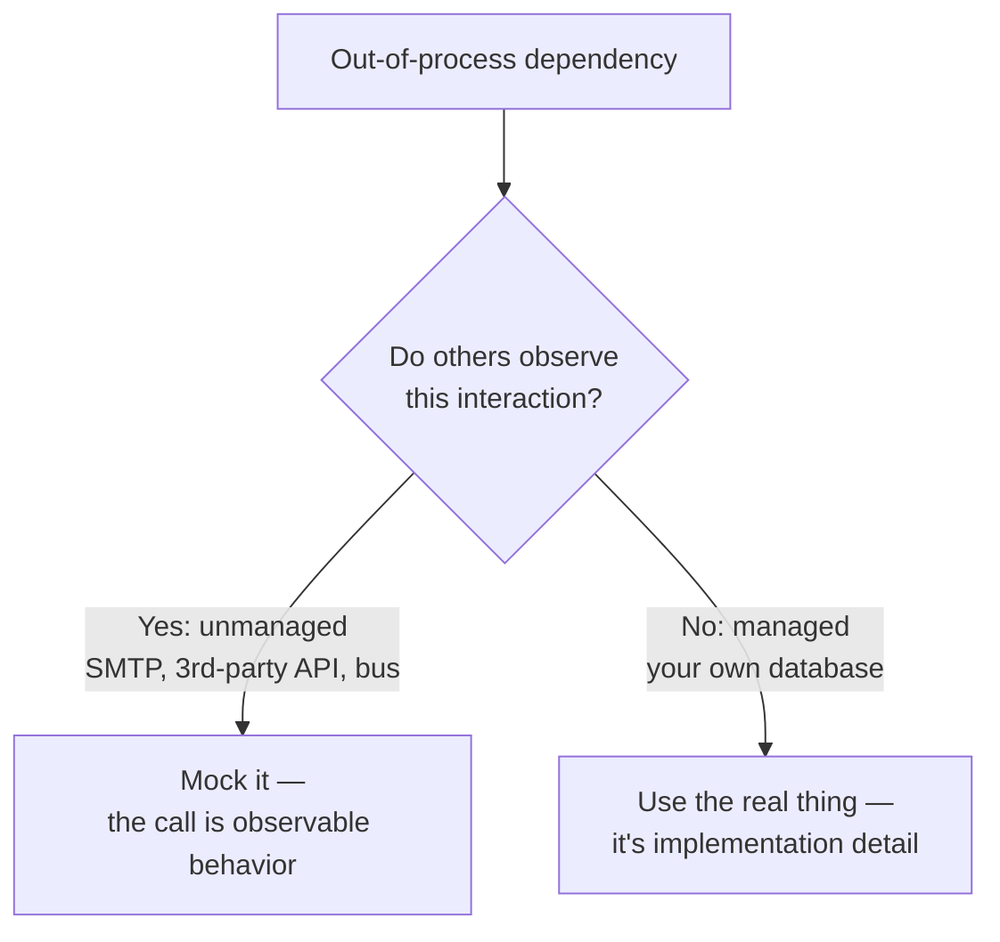

# Unit Testing: Principles, Practices, and Patterns

Vladimir Khorikov's 2020 book on how to write unit tests that are *worth having*. Its
argument: the goal of a test suite is not coverage or test count but **sustainable
project growth** — tests should let you keep changing the code confidently over time. A
bad test suite actively slows you down (brittle, slow, low-signal), so knowing which tests
to keep, refactor, or delete matters more than writing more of them.

## The four pillars of a good unit test

Khorikov judges every test against four attributes:

1. **Protection against regressions** — does the test actually catch bugs when the code
   breaks? A test that exercises little real logic protects little.
2. **Resistance to refactoring** — can you restructure the implementation without the test
   failing, as long as behavior is unchanged? Tests coupled to *how* the code works
   (rather than *what* it does) produce **false positives** and erode trust.
3. **Fast feedback** — the test runs quickly, so it can run often.
4. **Maintainability** — the test is easy to read and cheap to keep working.

The catch: the first two trade off against each other in tension with speed, so **no test
maximizes all four**. Protection and resistance-to-refactoring are treated as
non-negotiable; you trade fast feedback and maintainability at the margins. This framework
is how the book decides a test's value.

## Test behavior, not implementation

The through-line of the four pillars is: **couple tests to observable behavior, not to
internal structure.** A test should assert on the outcome a user of the unit cares about,
not on which private methods were called in what order. This is what buys
resistance-to-refactoring — the property that lets a test suite *support* change instead
of fighting it. It's the same insight that makes [Refactoring](refactoring-improving-the-design-of-existing-code.md)
safe and is central to good [TDD](test-driven-development-by-example.md).

## Mock only unmanaged dependencies

The book's most cited rule concerns test doubles. Khorikov splits a system's collaborators
into two kinds:

- **Managed dependencies** — out-of-process things that are *implementation detail*,
  fully under your control and invisible to the outside world. The canonical example is
  **your own database**. Do **not** mock these; use the real thing (or a close stand-in)
  so tests verify actual behavior.
- **Unmanaged dependencies** — out-of-process things you *don't* control and that
  represent **observable communication** with the outside world: an SMTP server, a
  third-party API, a message bus other systems read. Mocking these is legitimate, because
  the *fact of the call* is part of your system's observable behavior.

So: **mock unmanaged dependencies; use real managed dependencies.** Over-mocking (mocking
the database, mocking everything) is the classic mistake — it couples tests to
implementation and destroys resistance-to-refactoring.

## Test styles and the testing pyramid

Khorikov frames three styles — **output-based** (functional, best), **state-based**, and
**communication-based** (verifying interactions, use sparingly) — and favors the
output-based style, reachable by pushing logic toward pure functions. He also revisits the
**testing pyramid**: many fast unit tests, fewer integration tests, fewest end-to-end
tests, with integration tests reserved for the code paths that touch unmanaged
dependencies and the important edge cases.

## Relation to other notes

- Provides the quality bar for the tests that [TDD by Example](test-driven-development-by-example.md)
  and [The Five Practices That Set TDD Apart](tdd-five-practices.md) produce.
- The "test behavior not structure" rule is what keeps a suite from blocking
  [Refactoring](refactoring-improving-the-design-of-existing-code.md).
- Fast, trustworthy unit tests are the fuel for the commit stage of a
  [Continuous Delivery](continuous-delivery.md) pipeline.
- Complements the RSpec-specific guidance in
  [Effective Testing with RSpec 3](effective-testing-with-rspec-3.md).

## References

- [Unit Testing: Principles, Practices, and Patterns — Manning](https://www.manning.com/books/unit-testing)
