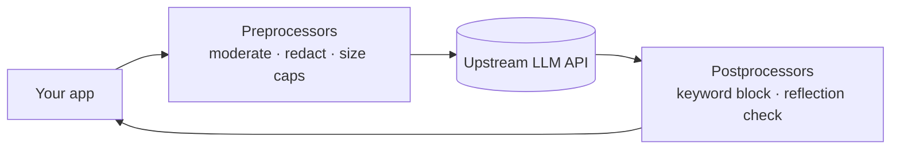

# Usage Panda LLM Proxy

A lightweight open-source proxy that sits **between your application and an LLM
API** (OpenAI, Azure OpenAI, PaLM, etc.) and enforces security, cost, rate-limit,
and compliance policy on both requests and responses. It is the concrete "common
implementation" that the [Guardrails Proxy](guardrails-proxy.md) pattern points to:
a firewall between your app's user-generated content and the upstream model.

In its simplest mode it is a pass-through that logs each request/response with
metadata (latency, end-user info, policy flags). Turn on more preprocessors and it
starts inspecting, redacting, or blocking traffic.

## Why it exists

Experimenting with an LLM API is easy; **operationalizing one for production is
not**. Teams have to reckon with cost, security, compliance, data protection,
logging/auditing, error handling, and failover all at once. Usage Panda answers
those concerns in one interception point rather than scattering them through app
code.

## What it does

- **Audit logging** — full request/response detail per API key, with metadata and
  security/compliance flags.
- **Cost protections** — cap request sizes, enforce `max_tokens`, and restrict
  which models are reachable through the proxy.
- **Content moderation** — audit, redact, or block profanity, adult content, and
  likely prompt-tampering prompts (e.g. "Do Anything Now" jailbreaks) by calling
  OpenAI's moderation API.
- **Auth management** — hold the real API key at the proxy so downstream apps never
  need their own; layer your own authz in front.
- **Auto-retry** — retry failed upstream calls.
- **Prompt reflection detection** — mark parts of a prompt with delimiters as
  secret, then audit/redact/block responses that leak them.

It is deliberately lightweight (one direct dependency, under 500 KB) and deploys
locally beside the app, as a Kubernetes container, or serverless (e.g. AWS Lambda).

## How it works — the plugin model

Each request runs through a chain of **preprocessors**; each response through a
chain of **postprocessors**. A processor (e.g. `auto-moderate`) reads its config
from a request header first, falling back to the local `config.js` — so policy can
be set globally or per-request. An experimental API-converter layer can translate
OpenAI-shaped requests to other providers.

## Related

- [Guardrails Proxy](guardrails-proxy.md) — the pattern this tool implements; the
  runtime policy-and-safety layer on model traffic.
- [MCP Gateway](mcp-gateway.md) — the sibling root-of-trust for tool traffic (this
  one guards model traffic).
- [Model Router](model-router.md) — the request-path sibling that decides *where* a
  call goes; this decides whether it is allowed and safe.
- [AI Code Security](ai-code-security.md) — guarding the produced artifact vs
  guarding runtime traffic.

## References
- [usagepanda/proxy — GitHub](https://github.com/usagepanda/proxy)
