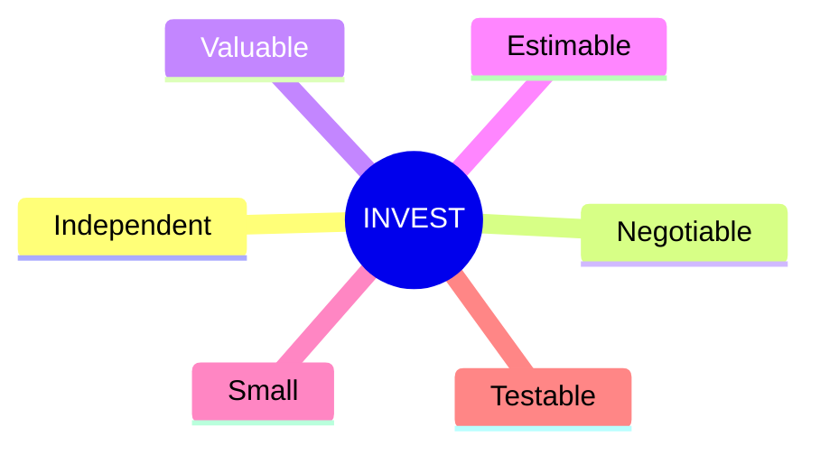

# User Stories Applied

Mike Cohn's *User Stories Applied: For Agile Software Development*
(Addison-Wesley, 2004) is the book that made user stories the default unit of
work in agile teams. A story is a short description of functionality told from the
perspective of someone who wants it, usually in the form:

> **As a** *&lt;role&gt;*, **I want** *&lt;capability&gt;*, **so that** *&lt;benefit&gt;*.

The crucial point Cohn makes is that a story is **a placeholder for a
conversation**, not a complete specification. The card is a reminder; the details
are filled in through discussion and captured as **conditions of satisfaction** —
the acceptance tests that tell you the story is done. This keeps stories small and
negotiable rather than turning them into miniature contracts.

## The INVEST criteria

Cohn popularized (crediting Bill Wake) the **INVEST** checklist for a good story:

- **Independent** — can be scheduled and built without depending on other stories.
- **Negotiable** — a starting point for conversation, not a fixed contract.
- **Valuable** — delivers value to a user or customer, not just to developers.
- **Estimable** — the team can size it; if they can't, it needs more detail or
  splitting.
- **Small** — fits comfortably within an iteration; large stories ("epics") get
  split.
- **Testable** — has conditions of satisfaction you can verify pass/fail.

*Testable* is the hinge that connects stories to the rest of requirements
practice: a story with no verifiable acceptance test is not ready, the same
standard [Software Requirements](software-requirements.md) applies to functional
requirements. The "so that" clause guards *Valuable* — if you can't state the
benefit, question whether the story should exist at all.

## Card, Conversation, Confirmation

Ron Jeffries' "three C's" frame the lifecycle Cohn describes: the **Card** holds
the story text, the **Conversation** fleshes out intent between the customer and
the team, and the **Confirmation** is the set of acceptance tests that confirm
completion. This is the on-ramp to acceptance-test-driven flows — writing those
confirmations as executable checks is what
[ATDD by Example](atdd-by-example.md) and
[Specification by Example](specification-by-example.md) teach.

## Splitting and estimating

Cohn also covers slicing epics into thin vertical stories (each delivering some
end-to-end value), estimating with relative sizing (story points, planning poker),
and using velocity to plan releases. The discipline of keeping stories *Small* and
*Independent* is what makes incremental, testable delivery possible — the same
bias toward small, verifiable steps found in
[TDD by Example](test-driven-development-by-example.md) and the pragmatic
prioritization in [The Effective Engineer](the-effective-engineer.md).

## References

- [User Stories Applied — Mountain Goat Software](https://www.mountaingoatsoftware.com/books/user-stories-applied)
