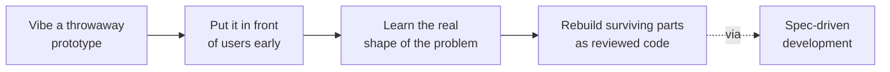

# Vibe Coding

**Vibe coding is letting the model drive.** You describe intent in natural
language — often by voice — accept what it generates, run it, and paste errors
back until it works, all without reading most of the code. Coined by Andrej
Karpathy: *"a new kind of coding … where you fully give in to the vibes, embrace
exponentials, and forget that the code even exists."*

The defining move is **not** the use of AI — it's the deliberate surrender of
comprehension. You trust the vibes over the diff.

## The boundary

Simon Willison draws the line: *"not all AI-assisted programming is vibe
coding."* If you read and understand every change before it lands, you're doing
**AI-assisted engineering**, not vibe coding. The term names the specific mode
where you *stop looking*.

Held to its original meaning, that mode fits **prototypes, throwaway scripts,
and personal tools** — "putting the soft back in software" — where being wrong
is cheap and no one else depends on the result.

## Why it's contested

The term spread faster than almost any in the field and polarized the community:

- **Critics:** a dystopia of unreviewed slop flowing straight to production.
- **Advocates** (Willison, Dion Almaer): it "grants millions of new people the
  ability to build their own custom tools."

Both are right — they describe **different uses of the same technique**. The
disagreement is rarely about what vibe coding *is*, almost always about *where*
it belongs. The practical line teams draw is by **stakes**: vibe freely on the
disposable and personal; switch back to reviewed, understood code the moment
something ships or someone else has to maintain it.

## The generative upside: discover what to build

The production-risk framing buries a real benefit: vibe coding is one of the
fastest ways to **discover what to build**. A rough working prototype in an
afternoon — one you're willing to throw away — surfaces real requirements, edge
cases, and dead ends faster than an abstract spec.

The workflow:

The artifact is disposable; **the learning is the deliverable**. Related to
[spec-driven development](spec-driven-development.md) — vibe to explore, then
rebuild what survives as understood code.

## References
- [Vibe Coding — Tessl Patterns](https://tessl.io/patterns/agentic-development-workflow/vibe-coding/)
