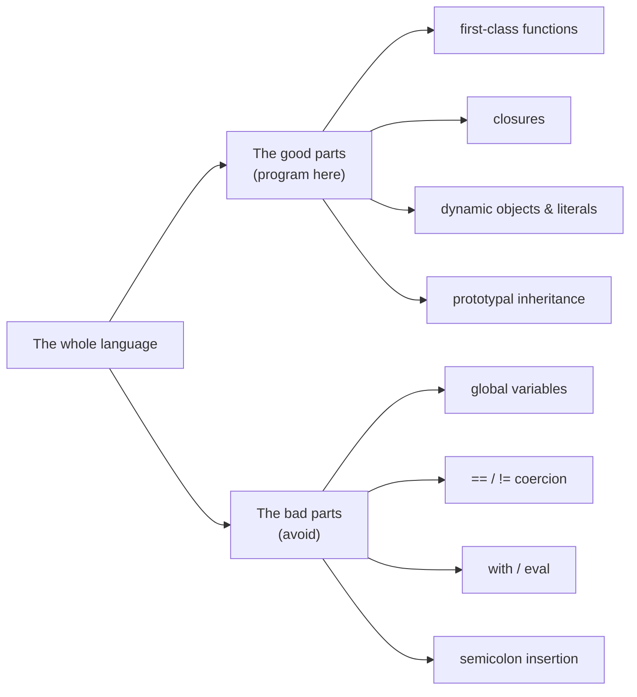

# JavaScript: The Good Parts

Douglas Crockford's short, opinionated book argues that JavaScript is really two
languages tangled together: an elegant, expressive core, and a much larger surface of
mistakes, misfeatures, and historical accidents. The central move is not to master the
whole language but to identify the good subset and program deliberately inside it,
leaving the bad parts unused. It's an early, influential statement of the idea that a
disciplined subset beats total mastery — the same instinct behind
[Code Simplicity](../software-engineering/code-simplicity.md) and [Clean Code](../software-engineering/clean-code.md).

## Thesis: a good language buried in a big one

Every language accumulates features; not all of them are worth using. Crockford's claim
is that the value of a feature is not that it exists but that a working programmer would
choose it. By restricting yourself to the good parts, you write code that is simpler,
easier to reason about, and less prone to the class of bugs the language's weak spots
invite. Quantity of features is not quality; the goal is a small, reliable vocabulary you
use consistently.

## The good parts

- **Functions as first-class objects.** Functions are values: they can be stored in
  variables, passed as arguments, returned from other functions, and given properties.
  This is the language's greatest strength and the foundation for most of the good parts.
- **Closures.** A function retains access to the variables of the scope in which it was
  defined, even after that scope has returned. Closures give you private state and
  modules without a class system.
- **Dynamic objects.** Objects are mutable keyed collections; properties can be added,
  changed, or removed at runtime. There is no rigid class contract to satisfy.
- **Object literals.** Objects and arrays have a clean, direct literal notation, which is
  also the basis of JSON (a data format Crockford himself formalized).
- **Prototypal inheritance.** Objects inherit directly from other objects rather than
  from classes. Crockford treats this as a genuinely good idea that the language dressed
  up awkwardly; used directly it is simpler than the classical model it imitates.
- **Loose typing.** You are freed from declaring types, which removes a category of
  ceremony — provided you stay disciplined about equality and coercion (see below).

## Function invocation patterns and `this`

A recurring theme is that what `this` refers to depends entirely on *how* a function is
called, not where it is defined. Crockford lays out four invocation patterns:

- **Method** — called as a property of an object (`obj.f()`); `this` is that object.
- **Function** — called on its own (`f()`); `this` is bound to the global object, which is
  a design mistake and a frequent source of bugs. The common workaround is to capture the
  outer `this` in a variable (`var that = this;`) inside methods.
- **Constructor** — called with `new`; a fresh object is created and bound to `this`.
- **Apply / call** — invoked with an explicit `this` and an argument array, letting you
  choose the binding directly.

Getting the invocation pattern right is most of what it takes to keep `this` predictable.

## Avoiding the bad parts

Crockford splits the rejects into the truly harmful ("Awful Parts") and the merely
unhelpful ("Bad Parts"). The ones to actively avoid:

- **Global variables.** Implicit globals are the language's worst weakness — they couple
  unrelated code and create hard-to-trace collisions. Wrap code so nothing leaks to
  global scope.
- **`==` vs `===`.** The loose equality operators (`==`, `!=`) apply surprising coercion
  rules and are effectively broken. Always use the strict `===` and `!==`, which compare
  without coercion.
- **`with`.** Ambiguous and confusing about which scope a name resolves to; never use it.
- **`eval`.** Slows things down, opens security holes, and defeats tooling; almost every
  use has a better alternative.
- **Automatic semicolon insertion.** The parser guesses where statements end, which can
  silently change meaning (e.g. a `return` followed by a newline). Write your own
  semicolons and don't rely on the guess.
- Other traps he flags: `typeof` quirks, `NaN`, phony arrays, `parseInt` without a radix,
  the `+` operator overloading add and concatenate, floating-point imprecision, and the
  `void` operator.

## Style guidance

Crockford is unapologetically prescriptive about style, on the grounds that consistent,
conservative code is easier to read and less bug-prone:

- Prefer forms that fail loudly over forms that fail silently.
- Declare variables at the top of functions; there is no block scope for `var`, so
  scattering declarations misleads the reader.
- Always brace blocks and always terminate statements with explicit semicolons.
- Keep to the good subset consistently rather than switching styles per file.

These conventions were later codified in his JSLint tool.

## A note on age

The book predates ES6 (2015) and everything after it. Several specifics are now dated:
`let`/`const` give real block scope, classes and modules formalize patterns Crockford had
to hand-roll, arrow functions largely fix the `this`-binding pain, and `Number.isNaN` and
friends smooth over old traps. But the framing has aged well: **choose a disciplined
subset of your language and stay inside it.** Modern linters, style guides, and
"good parts" configs are direct descendants of this argument, which is why it still reads
as relevant even where the code examples don't.

## References

- [JavaScript: The Good Parts — O'Reilly](https://www.oreilly.com/library/view/javascript-the-good/9780596517748/)
