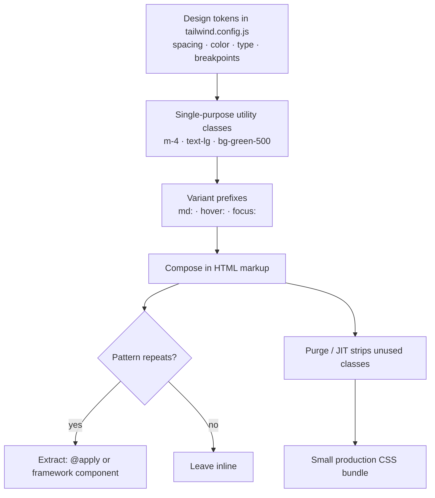

# Modern CSS with Tailwind

Noel Rappin's practical guide (Pragmatic Bookshelf, 2021) to styling web pages
with **Tailwind CSS**. The book is written against **Tailwind 2.0** — the framework
moves fast, so treat specifics as a snapshot and the official docs as the live source.
It assumes you already know CSS basics; the focus is Tailwind, not raw CSS.

## The utility-first philosophy

Traditional CSS frameworks (Bootstrap, Bulma) ship *semantic* classes — `button`,
`card`, `nav` — each bundling many style declarations behind one name. Tailwind
inverts this: almost every class is a thin wrapper around a **single** CSS property,
e.g. `m-4` → `margin: 1rem`, `text-lg` → `font-size: 1.125rem`. You compose an
element's appearance by listing many small utilities in the markup rather than
writing a bespoke rule in a stylesheet.

The payoff is a set of properties that follow directly from how CSS actually works:

- **Composition over authorship.** You assemble designs from a fixed vocabulary of
  utilities instead of writing new CSS. The design lives in the HTML, so you can read
  an element's full presentation by looking at its class list — no jumping to a
  separate stylesheet and reverse-engineering selector precedence.
- **No naming things.** The hardest part of hand-rolled CSS is inventing (and keeping
  consistent) class names and organizing them — BEM and similar conventions exist
  entirely to tame this. Utilities remove the naming problem: there is nothing to name
  because you are not authoring rules.
- **Bounded, local change.** Changing horizontal padding is `px-4` → `px-6` on the one
  element. You never wonder what *else* a shared semantic class touches, because a
  utility does exactly one thing and is scoped to where it appears. This makes
  prototyping and iteration fast and the blast radius of an edit obvious — a recurring
  theme also in [Refactoring UI](../ux-design/refactoring-ui.md).
- **Small production builds via purge/JIT.** A framework of thousands of utilities
  sounds enormous, but Tailwind scans your templates and strips every class you never
  use, so shipped CSS stays tiny. (2.0-era Tailwind did this with a PurgeCSS pass; later
  versions fold it into a just-in-time compiler that generates only used classes on the
  fly.) Keeping the delivered stylesheet lean matters for load performance — see
  [Designing for Performance](../ux-design/designing-for-performance.md).

## Design tokens and the config system

Utilities are not arbitrary — they draw from a **design system** encoded in the config
file (`tailwind.config.js`). Spacing, colors, font sizes, breakpoints, shadows, and the
rest are defined as scales of tokens, and every utility class references a token. `m-4`,
`p-4`, `gap-4` all resolve to the same `4` step, so spacing stays consistent across the
whole site by construction. Customization happens in this one file: override default
token values, extend the palette, adjust generated classes, configure variant prefixes,
or integrate with existing CSS. Tailwind also ships **Preflight**, a baseline reset that
normalizes browser defaults so you build from a predictable starting point.

## Responsive and state variants

The same utility vocabulary handles conditional styling through **variant prefixes**:

- **Responsive:** breakpoint prefixes (`sm:`, `md:`, `lg:`, `xl:`) apply a utility only
  at or above a screen width — `md:flex`, `lg:grid-cols-3`. Tailwind is mobile-first, so
  an unprefixed utility is the base and prefixes layer on larger screens. This lets you
  hide/show elements or change grid column counts per device size, all in the markup.
- **State:** pseudo-class prefixes (`hover:`, `focus:`, `active:`, and others) apply a
  utility only in that state — `hover:bg-green-700`.

Variants stack, so responsive + state combine (`md:hover:...`) without any custom CSS.

## Extracting components from repeated patterns

Listing the same long class string on every button is real duplication, and the book is
candid about the "ugh" reaction. Two escape hatches:

1. **`@apply`** — fold a set of utilities into a named CSS class in your own stylesheet
   when you genuinely need a reusable, named component.
2. **Framework component extraction** — let your view layer (React components, Rails
   partials, etc.) own the repetition. The book's bias is toward this: reach for the web
   framework you already have before introducing new CSS abstractions, extracting a
   component only once a pattern has actually repeated rather than up front.

## Layout with utilities: the box, flexbox, and grid

Tailwind exposes the CSS box model and modern layout as utilities:

- **The box:** padding (`p-*`), margin (`m-*`), borders (`border-*`), background color
  and images (`bg-*`), and explicit height/width (`h-*`, `w-*`).
- **Page layout:** containers, floats/clears, position and z-index, plus the two modern
  engines — **flexbox** (`flex`, `flex-row`/`flex-col`, `justify-*`, `items-*`) for
  one-dimensional alignment, and **grid** (`grid`, `grid-cols-*`, `gap-*`) for
  two-dimensional layout. Box-alignment utilities cover the cross-axis details.

## Tradeoffs vs traditional CSS / BEM

- **In favor:** presentation is co-located with markup and readable at a glance; no
  naming or selector-specificity wars; consistency enforced by the token scale; edits are
  local and low-risk; production bundles are small after purge/JIT.
- **Against:** class lists are verbose and initially off-putting ("ugh"); it mixes
  presentation into HTML, which offends the separation-of-concerns instinct behind
  semantic CSS and BEM; you must learn the utility vocabulary; and without disciplined
  component extraction, repeated class strings become their own maintenance burden.

The book's stance: the explicitness and locality are worth the verbosity, especially for
prototyping and iteration, and the duplication problem is solvable with `@apply` or,
preferably, ordinary framework components.

## References

- [Modern CSS with Tailwind — Pragmatic Bookshelf](https://pragprog.com/titles/tailwind/modern-css-with-tailwind/)
