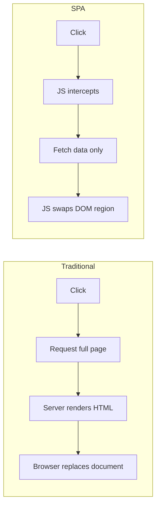

# SPA Design and Architecture

Emmit A. Scott Jr.'s *SPA Design and Architecture: Understanding Single-Page Web
Applications* (Manning) is a framework-agnostic tour of the moving parts that make up a
single-page application. It predates the current React/Vue/Angular consolidation, so its
code uses now-dated tools (RequireJS, hand-rolled MV\* setups). The value is not the
tooling — it's that the book names each architectural role in a SPA and explains what it
does, and those roles are exactly the ones modern frameworks now hide behind a component
API. Reading it is a good way to see *why* a router, a view layer, a module system, and a
data layer all have to exist, independent of any one library.

## What a single-page application is, and why

A traditional web app is server-centric: each user action requests a whole new HTML page,
the browser tears down the current document and paints a fresh one, and state lives on the
server between requests. A SPA inverts this. The browser loads one shell document once,
then JavaScript takes over: it swaps out regions of the DOM in place, fetches only data
(not markup) from the server, and manages navigation itself. There is no full-page reload
after the initial load.

The payoff is an app-like user experience — instant view transitions, preserved scroll and
input state, no white flash between screens — and lighter network traffic, since the wire
carries data rather than re-rendered pages. The cost is that responsibilities that used to
belong to the server (routing, view assembly, templating) now have to be re-implemented on
the client, which is what the rest of the book is about.

## Client-side MV\* patterns (MVC / MVP / MVVM)

Once presentation logic lives in the browser, you need a discipline to keep it from
collapsing into DOM-manipulation spaghetti. The book uses "MV\*" as an umbrella for the
family of separation-of-concerns patterns — MVC, MVP, MVVM — that split an app into a
**model** (data + domain state), a **view** (what the user sees), and some mediating layer
(controller / presenter / view-model) that keeps the two in sync. The differences between
the variants are mostly about *how* view and model stay synchronized (explicit controller
calls vs. two-way data **binding**), and real frameworks blur the lines — hence the
wildcard.

The concrete building blocks a client MV\* framework gives you:

- **Models** — observable data objects that notify when they change.
- **Bindings** — declarative wiring so a change in the model updates the view (and often
  vice versa) without manual DOM code.
- **Templates** — markup with placeholders that render a model into HTML.
- **Views** — the objects that own a piece of the screen and its lifecycle.

The reasons to adopt one: separation of concerns, routine DOM/sync work handled for you,
productivity, a standard structure the whole team recognizes, and scalability as the app
grows. This is the same value proposition modern component frameworks make — the book just
shows the seams. It is a client-side, presentation-layer echo of the layering discipline in
[Clean Architecture](../software-architecture/clean-architecture.md): keep policy (the model) independent of the
delivery mechanism (the view).

## Client-side routing

In a SPA the URL still has to mean something — deep links, back/forward buttons, and
bookmarks must work — but navigation can no longer hit the server for a new page. A
**client-side router** maps URL patterns to application state and swaps views accordingly,
all in the browser. Routes are configured as patterns (with parameters and a default
route), and the router resolves the current URL to the right view.

Two mechanisms make this possible without a server round-trip:

- **The fragment identifier (hash) method** — everything after `#` in the URL can change
  without triggering a page load; the router listens for hash changes.
- **The HTML5 History API method** — `pushState`/`popState` let the app change the visible
  URL path and respond to back/forward, giving clean URLs (no `#`) at the cost of needing
  server cooperation for direct hits on deep links.

## View composition, layout, and templating

A real screen is not one monolithic view; it's assembled from parts. The book frames this
as **views** placed into **regions** of a layout, with **view composition** (and **nested
views**) building complex screens out of smaller, independently-managed pieces. A base
layout defines the stable chrome; routes drive which content view fills the main region; a
**view manager** coordinates swapping, showing, and tearing down views so old ones release
their resources. **Templates** turn model data into the markup a view renders. This
decomposition is the direct ancestor of today's component trees.

## Module patterns and dependency management

To keep a growing JavaScript codebase sane, the book leans on the **module pattern** — using
closures to get privacy, expose a deliberate public **API**, and give each unit a single
responsibility (SRP). The **revealing module pattern** is the recommended shape: build
everything privately, then return an object that reveals only the intended public members.

Modules solve concrete problems: they avoid global-namespace collisions, protect internal
state from outside tampering, hide complexity behind an interface, localize the blast radius
of a change, and organize the code. Because browsers of that era had no native module
system, dependencies were managed with **script loaders** and the **AMD** (Asynchronous
Module Definition) format, loaded via **RequireJS**. The specific tooling is obsolete — ES
modules and bundlers replaced it — but the underlying goals (encapsulation, explicit
dependencies, controlled public surface) are exactly what module systems still enforce
today, and they connect to the broader vocabulary of design patterns in
[Learning Patterns](learning-patterns.md).

**Inter-module interaction** is treated as its own concern: modules should collaborate
through controlled APIs (and often through a mediator / event bus) rather than reaching into
each other's internals, so the system stays loosely coupled.

## Client-side data — talking to services

A SPA fetches data, not pages. The book covers communicating with the server over
**XMLHttpRequest** (the pre-`fetch` browser HTTP primitive) and organizing that access so
views and models don't make raw network calls scattered throughout the UI. The pattern is to
concentrate server communication behind a data/service layer that the rest of the app talks
to, keeping the transport details in one place — again the same isolation principle as
[Clean Architecture](../software-architecture/clean-architecture.md), applied to the browser's I/O boundary.

## Testing SPAs

Because so much logic now lives on the client, the book treats **unit testing** as a
first-class concern rather than an afterthought, and pairs it with **client-side task
automation** (build/test running, in its era via Gulp.js) so tests actually run as part of
the workflow. The architectural payoff of all the separation above is testability: models,
modules, and views with clear APIs can be exercised in isolation. A modern echo of the same
discipline appears in [React for Real](react-for-real.md), which carries these concerns into
a component-based world.

## Why it still matters

Nearly every idea here now ships inside a framework: the router, the component/view tree,
the module system, the data layer, the test harness. Learning them as separate,
named responsibilities — as this book presents them — makes it much easier to reason about
what a framework is doing for you and to debug it when the abstraction leaks. The tooling
dated fast; the architecture did not.

## References

- [SPA Design and Architecture — Manning](https://www.manning.com/books/spa-design-and-architecture)
