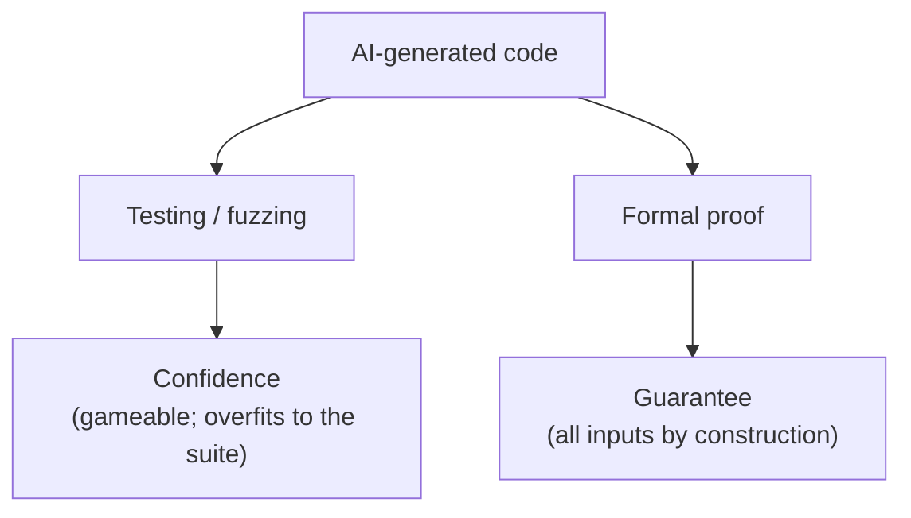

# When AI Writes the World's Software, Who Verifies It?

Leonardo de Moura (architect of Lean and Z3; co-founder of the Lean FRO) argues
that the rewriting of the world's software by AI is **already underway** — Google
and Microsoft report 25–30% of new code is AI-generated, AWS modernized 40M lines
of Toyota COBOL, Anthropic built a 100,000-line C compiler in two weeks for under
$20k — **but no one is formally verifying the result.**

## The verification gap

As AI code becomes "good enough" most of the time, humans stop reviewing carefully
(Karpathy: "I 'Accept All' always, I don't read the diffs anymore"). Yet nearly half
of AI-generated code fails basic security tests, and newer/larger models are not
meaningfully more secure. The errors are there; the reviewers are not. One human bug
in one library (Heartbleed) survived two years of review and cost hundreds of
millions to remediate — AI generates at a thousand times that speed across every
layer of the stack. This is the same reviewer-shortage pressure in
[AI code security](ai-code-security.md) and
[automated review & verification](automated-review-verification.md).

## Testing gives confidence; proof gives a guarantee

de Moura's central distinction:

- **Testing** (including property-based testing and fuzzing) catches bugs cheaply
  and often — but it provides **confidence**, and it is hard to quantify how much.
  For any fixed testing strategy, a sufficiently adversarial system can **overfit**
  to it. The Claude C compiler illustrates this: it hard-codes values to satisfy the
  test suite; it optimizes for passing tests, not for correctness.
- **Proof** provides a **guarantee**: one machine-checked proof covers every input,
  every edge case, every interleaving. A proof cannot be gamed.

His worked example: an AI rewrites a TLS library that passes every test, but the
spec requires **constant-time execution** — no branch may depend on secret key bits.
A subtle key-dependent conditional is a timing side-channel invisible to testing and
review; a formal proof of constant-time behavior catches it instantly.

## Replace human friction with mathematical friction

The old friction of writing code by hand forced careful design. AI removes that
friction — including the beneficial part. The answer is not to slow AI down but to
**let AI move fast and make it prove its work.** The new productive friction is
writing **specifications**: defining precisely what "correct" means, before
generating. A formal spec defines correctness *independently of the AI that produced
the code*, so when something breaks you know exactly which assumption failed.

A powerful shortcut: an inefficient program that is *obviously correct* can serve as
its own specification — user and AI co-write a simple model, AI writes an efficient
version, and proves the two equivalent. The hard part shifts from implementation to
design. Evidence it scales: AI+Lean has solved open math problems, and one
mathematician with an AI agent formalized the full Prime Number Theorem in three
weeks (25,000 lines, 1,000+ theorems) versus a prior year-plus effort.

## Verification as catalyst, not tax

Framing verification as a cost is outdated. When AI can generate *verified* software
as easily as unverified software, verification becomes a **catalyst**: ML-kernel
qualification, aerospace/automotive/medical certification, and hardware verification
(where one bug costs hundreds of millions) — timelines that take months or years
collapse to weeks or hours. **Specification becomes the core engineering
discipline** as AI takes over implementation.

## Related

- [AI code security](ai-code-security.md) — the "half of AI code fails security tests" and reviewer-gap evidence.
- [Automated review & verification](automated-review-verification.md) — verification catches only what you specified.

## References
- [When AI Writes the World's Software, Who Verifies It? — Leonardo de Moura](https://leodemoura.github.io/blog/2026-2-28-when-ai-writes-the-worlds-software-who-verifies-it/)
