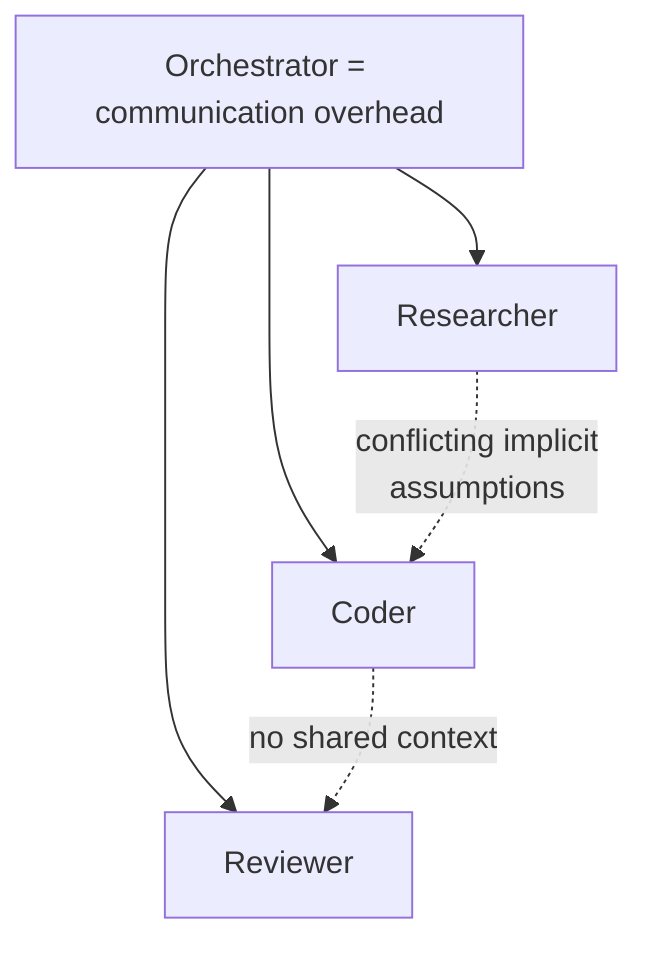

# You Don't Need Sub-Agents

**Anton Vinogradov** argues that the fashionable multi-agent "swarm" architecture —
an Orchestrator box at the top with arrows fanning down to a Researcher, a Coder, a
Reviewer — reinvents a problem the software field already solved and wrote down in 1975.
For most work, a **single agent loop beats a mesh of sub-agents.**

## We already ran this experiment. In 1975.

Fred Brooks ran it on IBM's OS/360 and recorded it in
[The Mythical Man-Month](the-mythical-man-month.md): adding people to a late project makes
it later. The cause is arithmetic, not laziness. Every new participant adds communication
paths, and paths grow as **n(n−1)/2** — coordination cost climbs faster than the help
arrives. Two people, one line; five people, ten; ten people, forty-five.

Now re-read the swarm diagram. The orchestrator's whole job is to hand out subtasks and
reconcile whatever comes back — which is to say, *to be* the communication overhead Brooks
warned about. "We took a fifty-year-old result about why throwing bodies at a problem
doesn't scale, ported it to language models, drew it in a nicer tool, and called it an
agent mesh."

## Why delegation degrades

Every layer of delegation loses context. A sub-agent cannot see what the others assumed,
so parallel agents make **conflicting implicit decisions** — Cognition's Walden Yan gave
the memorable example: ask two sub-agents to build the same thing and you get a bird in
one art style over a background in another. Each delegation hop also chips away at the
model's ability to chain tools and self-correct, because the reasoning context does not
travel with the subtask.

## Receipts from teams actually shipping agents

Vinogradov leans on practitioners, not theory:

- **PostHog**, after a year of production agents, concluded a single loop beats sub-agents
  for exactly this reason.
- **Cognition** — the company behind Devin — published *"Don't Build Multi-Agents"*
  (June 2025) making the context-loss argument.
- Ten months later (April 2026) Cognition's follow-up showed multi-agents that *do* work
  in production — but read the conditions. **The pattern that works keeps writes
  single-threaded: many agents can contribute intelligence, but one thread commits.** The
  free-for-all swarm of agents negotiating with each other is still filed under
  distraction. "The biggest proponent's 'we figured it out' turns out to be 'we stopped
  letting them step on each other.'"

## The takeaway

Default to a single, well-harnessed loop. If you must parallelise, keep a single writer —
one thread that commits — and treat extra agents as advisors, not co-authors. This is the
counterweight to the swarm enthusiasm in
[Cursor's Agent Swarm Built a Browser](cursor-agent-swarm-browser.md), and it rhymes with
[Loop Engineering Is Just Software Engineering](loop-engineering-is-just-software-engineering.md)
(both say: the hard part was solved long ago, stop reinventing it) and with
[Building Effective Agents (Anthropic)](building-effective-agents.md)'s "use the simplest
thing that works."

## References

- [You don't need sub-agents — Anton Vinogradov (DEV Community)](https://dev.to/tony__vi/you-dont-need-sub-agents-1eh7)
